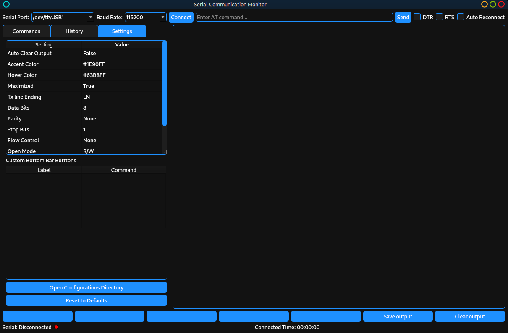

# Serial Communication Monitor

A modern, cross-platform serial monitor application inspired by CuteCom and the Arduino IDE Serial Monitor. This tool provides a user-friendly GUI for interacting with serial devices, sending AT commands, and viewing responses in real time.



## Features

- **Cross-platform GUI** (Windows, Linux, macOS) using PyQt5
- **Serial port selection** and baud rate configuration (including custom rates)
- **Send and receive** data over serial ports
- **Command history** with easy navigation and re-sending
- **Predefined AT command sets** loaded from YAML files (SIM800L, SIM808, and more)
- **Customizable quick-access buttons** for frequent commands
- **Dark theme** with accent color customization
- **Auto-reconnect** option for serial ports
- **Output saving** and clearing
- **Settings panel** for serial and UI preferences
- **Command history management** (view, insert, clear)
- **Output visualization** with optional hidden character reveal

## Getting Started

### Prerequisites

- Python 3.7+
- [PyQt5](https://pypi.org/project/PyQt5/)
- [pyserial](https://pypi.org/project/pyserial/)
- [pyyaml](https://pypi.org/project/PyYAML/)

Install dependencies:

```sh
pip install -r requirements.txt
```

### Running the Application

```sh
python App.py
```

### Windows Executable

Pre-built single-file executables for Windows will be available in the [Releases](https://github.com/your-repo/releases) section. No Python installation required—just download and run.

## Usage

1. Select the serial port and baud rate at the top.
2. Click **Connect** to open the serial connection.
3. Enter AT commands in the input field and press **Send** or Enter.
4. Use the **Commands** tab to browse and send predefined AT commands.
5. View and manage your command history in the **History** tab.
6. Adjust application and serial settings in the **Settings** tab.
7. Use the bottom bar buttons for quick access to custom commands.
8. Save or clear the output as needed.

## Configuration

- **Command Sets:** Place your YAML command files in the `commands/` directory. Example files for SIM800L and SIM808 are included.
- **Settings:** User settings are saved in a config directory specific to your OS (see `App.py` for details).
- **Custom Buttons:** Configure labels and commands for the bottom bar in the Settings tab.

## Directory Structure

```
App.py
README.md
requirements.txt
link_settings.yaml
commands/
    sim800l.yaml
    sim808.yaml
images/
    preview.png
logs/
```

## Similar Software

- CuteCom
- Arduino IDE Serial Monitor

## License

MIT License

*This project is not affiliated with CuteCom or Arduino. All trademarks are property of their