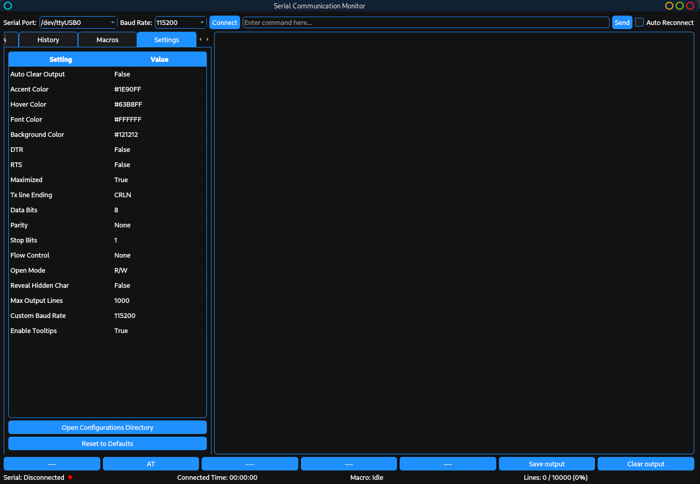

# Serial Communication Monitor

A modern, cross-platform serial monitor application built with PyQt5. This tool provides a powerful and user-friendly interface for interacting with serial devices, managing commands, executing macros, and viewing responses in real time.



## Tested Platforms

- ✅ **Windows 10**
- ✅ **Debian 13** (Trixie)
- Should work on macOS and other Linux distributions

## Features

### Core Functionality
- **Cross-platform support** (Windows 10+, Linux, macOS) using PyQt5
- **Serial port management** with auto-detection and reconnection
- **Flexible baud rate configuration** including custom rates
- **Real-time data transmission** with configurable line endings (CR, LF, CRLF)
- **Threaded serial reader** prevents UI freezing during data bursts
- **Command history** with quick access (single-click to insert, double-click to send)
- **Output display** with optional hex conversion and hidden character visualization

### Command Management
- **Command sets** loaded from YAML files with two categories:
  - Commands requiring no input (click to send)
  - Commands requiring input (click to insert template)
- **Commands Editor** for creating and managing command sets
- **Last selected command set** is remembered across sessions

### Macro System
- **Drag-and-drop macro editor** with Scratch-like interface
- **Three block types**:
  - Input blocks: Send commands
  - Delay blocks: Wait for specified duration
  - Output blocks: Expect response with timeout
- **Macro execution** with visual feedback

### Customization
- **Centralized theming** with StyleManager
- **Configurable colors**: Accent, hover, font, and background
- **Automatic color derivation** for secondary/tertiary backgrounds
- **Font size adjustment** for accessibility
- **Customizable quick-access buttons** (10 configurable buttons)
- **Tooltips** with enable/disable option
- **Settings persistence** across sessions

### Serial Configuration
- **DTR/RTS control** via settings
- **Configurable serial parameters**: Data bits, parity, stop bits, flow control
- **Open mode selection**: Read/Write, Read-only, Write-only
- **Auto-clear output** option
- **Maximum output lines** limit to prevent memory issues

## Getting Started

### Prerequisites

- Python 3.7+
- [PyQt5](https://pypi.org/project/PyQt5/)
- [pyserial](https://pypi.org/project/pyserial/)
- [PyYAML](https://pypi.org/project/PyYAML/)

Install dependencies:

```sh
pip install -r requirements.txt
```

### Running the Application

```sh
python App.py
```

### Windows Executable

Pre-built single-file executables for Windows will be available in the [Releases](https://github.com/DJA-prog/Serial-Gui/releases) section. No Python installation required—just download and run.

## Usage

### Basic Operation
1. Select the serial port and baud rate from the dropdowns
2. Click **Connect** to establish connection
3. Enter commands in the input field and press **Send** or Enter
4. Use **Send** button with empty input to repeat last command
5. Press Enter twice quickly to resend last command

### Command Tab
- Select a command set from the dropdown
- Click commands in "No Input Required" list to send immediately
- Click commands in "Require Input" list to insert template into input field
- Use **New Command List** to create custom command sets
- Use **Edit Selected List** to modify existing sets

### History Tab
- Single-click an entry to insert into input field
- Double-click an entry to send immediately
- View all previously sent commands
- Clear history with the button at bottom

### Macros Tab
- Create drag-and-drop automation sequences
- Add Input, Delay, and Output blocks
- Save macros for repeated use
- Execute macros with visual status updates

### Settings Tab
- **Colors**: Click to change accent, hover, font, and background colors
- **Serial Settings**: Configure DTR, RTS, data bits, parity, stop bits, flow control
- **Display Options**: Toggle tooltips, hidden characters, auto-clear output
- **Line Endings**: Choose CR, LF, or CRLF for transmitted data
- **Maximum Output Lines**: Set buffer limit (default: 10000)

### About Tab
- View application version
- Access GitHub repository
- Read application description

## Configuration

### Configuration Directory
Settings are stored in OS-specific locations:
- **Windows**: `%APPDATA%\SerialCommunicationMonitor\`
- **macOS**: `~/Library/Application Support/SerialCommunicationMonitor/`
- **Linux**: `~/.config/SerialCommunicationMonitor/`

### Files
- `settings.yaml`: Application settings and preferences
- `command_history.txt`: Command history log
- `commands/*.yaml`: Command set definitions
- `macros/*.yaml`: Saved macro sequences

### Command Set Format
```yaml
no_input_commands:
  AT: "Check if module is ready"
  ATE0: "Disable command echo"

input_required_commands:
  AT+CMGS: "Send SMS message"
  AT+CMGR: "Read SMS message"
```

## Keyboard Shortcuts

- **Enter**: Send command
- **Enter + Enter** (double-press): Resend last command
- **Up/Down arrows**: Navigate command history in input field

## Architecture

### Key Components
- **App.py**: Main application window and logic (v1.0.0)
- **StyleManager.py**: Centralized theming and stylesheet management
- **MacroEditor.py**: Drag-and-drop macro creation interface
- **CommandsEditor.py**: Command set editor with dual-list layout
- **SerialReaderThread**: Background thread for non-blocking serial I/O

### Design Patterns
- **Thread safety**: Qt signals/slots for cross-thread communication
- **Settings management**: YAML-based persistent storage
- **Style centralization**: Single source of truth for UI theming
- **Type hints**: Full type annotations for maintainability

## Directory Structure

```
App.py                      # Main application (v1.0.0)
StyleManager.py            # Centralized styling
MacroEditor.py             # Macro creation interface
CommandsEditor.py          # Command set editor
README.md
requirements.txt
MACROS.md                  # Macro system documentation
commands/
    sim800l.yaml          # SIM800L AT commands
    sim808.yaml           # SIM808 AT commands
images/
logs/
```

## Similar Software

- CuteCom (Linux serial terminal)
- Arduino IDE Serial Monitor
- PuTTY (with serial support)
- RealTerm (Windows)

## Contributing

Contributions are welcome! Please feel free to submit issues or pull requests.

## License

MIT License

## Acknowledgments

Inspired by CuteCom and Arduino IDE Serial Monitor. This project is not affiliated with these applications. All trademarks are property of their respective owners.