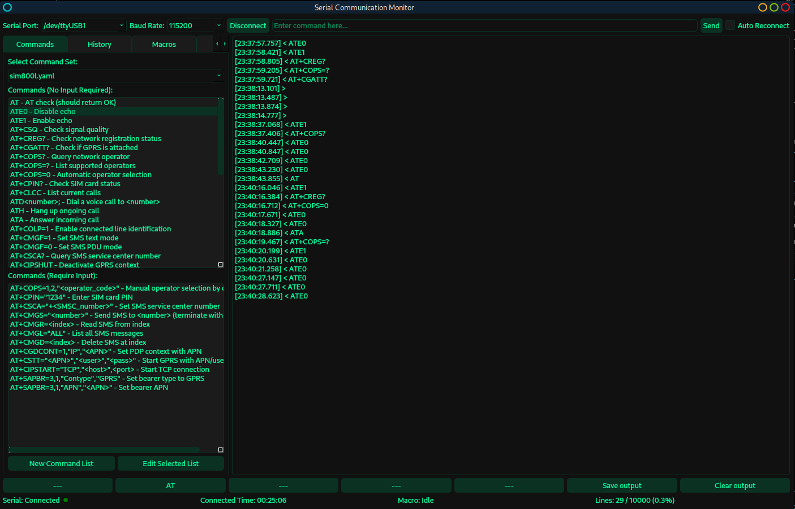
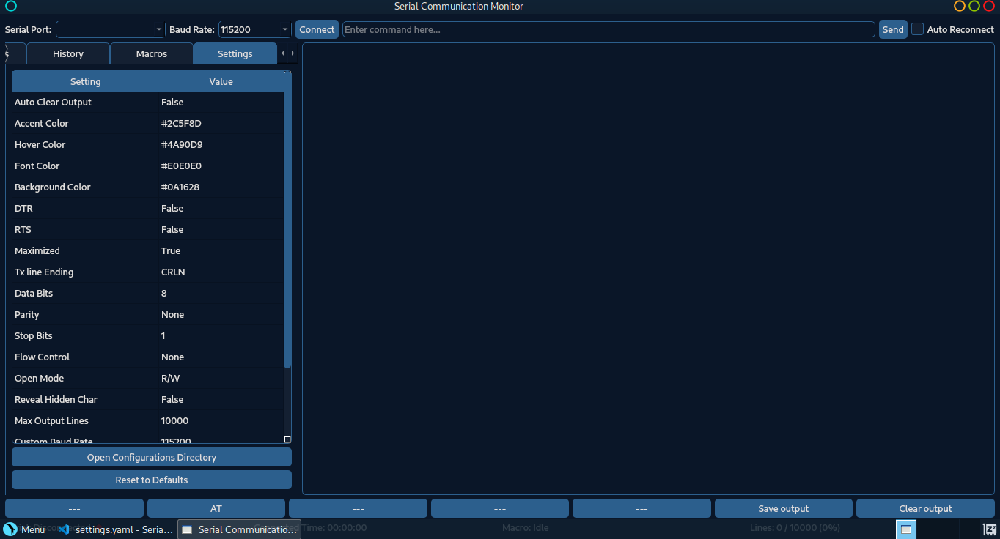
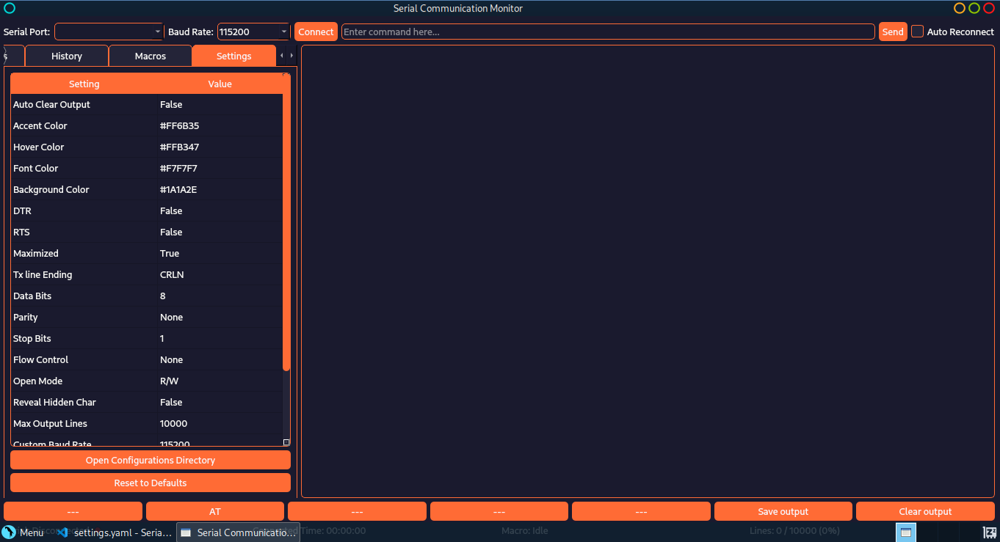
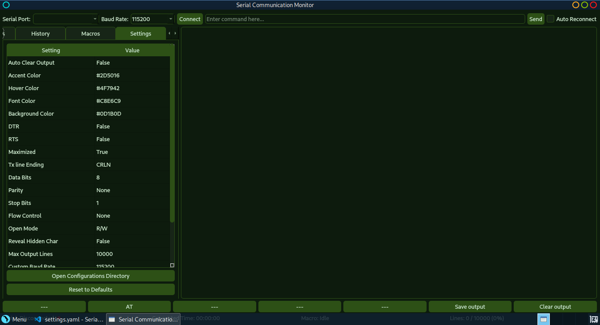
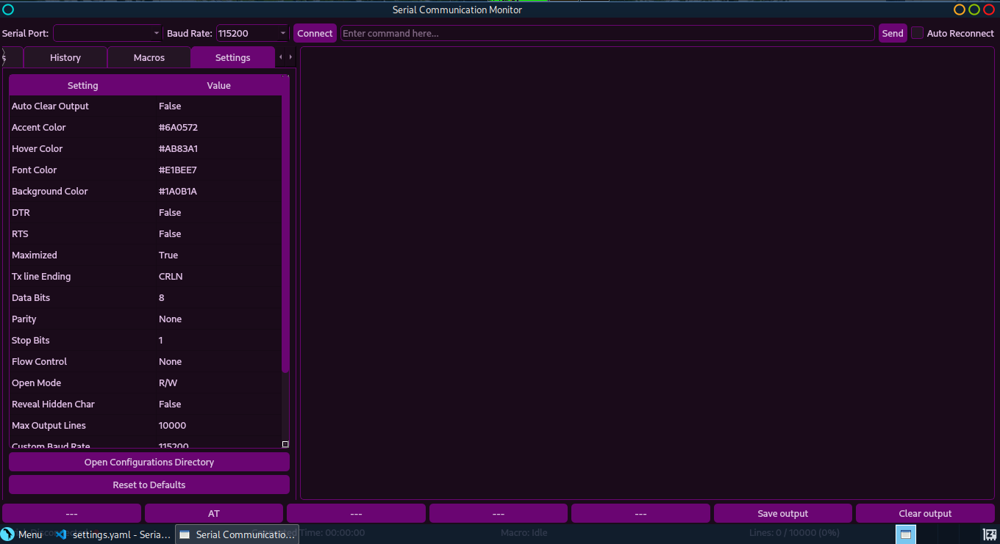

# Custom Color Themes

Serial Communication Monitor supports full customization of the application's color scheme. You can create your own themes by adjusting four key colors in the Settings tab.

## Color Settings

The application uses four primary colors that can be customized:

- **Accent Color** - Primary UI elements (buttons, borders, highlights)
- **Hover Color** - Interactive element hover states
- **Font Color** - All text throughout the application
- **Background Color** - Main application background

## How to Apply a Custom Theme

1. Open Serial Communication Monitor
2. Go to the **Settings** tab
3. Double-click on each color setting:
   - Accent Color
   - Hover Color
   - Font Color
   - Background Color
4. Use the color picker to select your desired color
5. Changes apply immediately

## Pre-made Themes

### Default Theme

Clean and professional dark theme with electric blue accents.

```yaml
accent_color: '#1E90FF'      # Dodger Blue
hover_color: '#63B8FF'       # Light Sky Blue
font_color: '#FFFFFF'        # White
background_color: '#121212'  # Near Black
```


**Best for:** General use, easy on the eyes for extended sessions

---

### Hacker mint Theme

Matrix-inspired green on black terminal aesthetic.

```yaml
accent_color: '#0b3123'      # Dark Forest Green
hover_color: '#ff505e'       # Coral Red
font_color: '#07fca2'        # Bright Cyan Green
background_color: '#111111'  # True Black
```



**Best for:** Terminal enthusiasts, retro computing aesthetic

---

## Creating Your Own Theme

### Tips for Good Color Combinations

1. **Contrast is key** - Ensure sufficient contrast between font and background colors
2. **Test readability** - Read text at various sizes to ensure it's comfortable
3. **Hover feedback** - Make sure hover color is distinct from accent color
4. **Consistency** - Choose colors that work well together

### Recommended Color Ratios

- **Font to Background:** Minimum 4.5:1 contrast ratio (WCAG AA standard)
- **Accent to Background:** Minimum 3:1 contrast ratio
- **Hover should be 10-20% brighter/darker** than accent color

### Color Psychology

- **Blue** - Professional, trustworthy, calm (good for monitoring)
- **Green** - Technical, terminal-like, easy on eyes
- **Red/Orange** - High visibility, warnings (use sparingly)
- **Purple** - Creative, modern, less common
- **Gray** - Neutral, minimal distraction

## Sharing Your Theme

If you create a theme you'd like to share:

1. Note down your four color hex codes
2. Take a screenshot of the application
3. Submit an issue or pull request to the [GitHub repository](https://github.com/DJA-prog/Serial-Gui)

## Theme Examples

### Midnight Blue
```yaml
accent_color: '#2C5F8D'
hover_color: '#4A90D9'
font_color: '#E0E0E0'
background_color: '#0A1628'
```

Professional dark blue theme with subtle contrasts.

### Sunset
```yaml
accent_color: '#FF6B35'
hover_color: '#FFB347'
font_color: '#F7F7F7'
background_color: '#1A1A2E'
```

Warm orange/red accents on deep navy.

### Monochrome
```yaml
accent_color: '#555555'
hover_color: '#888888'
font_color: '#DDDDDD'
background_color: '#1C1C1C'
```

Pure grayscale, minimal distraction.

### Forest
```yaml
accent_color: '#2D5016'
hover_color: '#4F7942'
font_color: '#C8E6C9'
background_color: '#0D1B0D'
```

Natural green tones, easy on the eyes.

### Purple Haze
```yaml
accent_color: '#6A0572'
hover_color: '#AB83A1'
font_color: '#E1BEE7'
background_color: '#1A0B1A'
```

Rich purple for a unique look.

## Troubleshooting

### Colors Look Washed Out
- Check your monitor's color calibration
- Ensure your graphics drivers are up to date
- Try increasing contrast between colors

### Text is Hard to Read
- Increase contrast ratio between font and background
- Try a lighter font color on dark background
- Avoid pure white (#FFFFFF) - use slightly off-white (#F0F0F0)

### Theme Doesn't Save
- Ensure you're clicking away from the settings after editing
- Check file permissions in config directory:
  - Linux: `~/.config/SerialCommunicationMonitor/`
  - Windows: `%APPDATA%/SerialCommunicationMonitor/`
  - macOS: `~/Library/Application Support/SerialCommunicationMonitor/`

## Advanced: Direct YAML Editing

You can also edit the settings file directly:

1. Close the application
2. Open `settings.yaml` in your config directory
3. Edit the color values under the `general` section:

```yaml
general:
  accent_color: '#1E90FF'
  hover_color: '#63B8FF'
  font_color: '#FFFFFF'
  background_color: '#121212'
```

4. Save the file
5. Restart the application

## Technical Details

- Colors are stored as hex codes in `#RRGGBB` format
- All colors support full RGB spectrum (16.7 million colors)
- Secondary/tertiary background colors are auto-calculated from primary
- Theme changes apply to all dialogs and windows
- Settings persist across sessions

## Resources

- [Color Contrast Checker](https://webaim.org/resources/contrastchecker/)
- [Adobe Color Wheel](https://color.adobe.com/)
- [Coolors - Color Palette Generator](https://coolors.co/)
- [Material Design Color Tool](https://material.io/resources/color/)

---

**Note:** Theme screenshots are examples. Actual appearance may vary based on your operating system and display settings.
